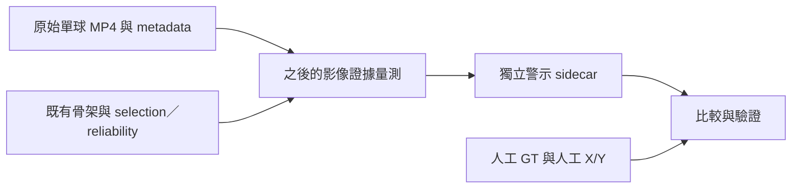

# Phase 2 — 可靠性警示設計與驗證方法

日期：2026-10-06（台灣）。**設計與驗證清單完成；尚未實作新警示；Phase 2 = IN PROGRESS。**

## 本次完成

已把現有五支影片、canonical人工紀錄、raw／processed資料及既有可靠性輸出綁定為可追查的驗證清單，共592格。
另固定14個已知案例，供之後驗證重大錯位、局部錯點、骨架缺失、遮擋排除與誤警。
這是設計文件與既有結果重核，不是新detector、學習結果或Phase 2驗收。

- 可供程式讀取的計畫：[phase2_warning_design_20261006.json](evaluation_plans/phase2_warning_design_20261006.json)。
- 原始診斷：[pitch_003錯位來源](phase2_pitch003_diagnosis_20261006.md)。
- 本機衍生清單：`analysis_results/phase2_warning_design_20261006_01/`。

不修改MediaPipe、PitcherSelector、既有threshold／confidence gate、pose、smoothing／interpolation、人工標註或原始prediction。
新警示若之後實作，會寫入新的sidecar；目前所有數字仍是原baseline。

## 先分清楚要警示什麼

| 問題 | 警示用途 | 人工比較目標 | 不能直接推出 |
|---|---|---|---|
| 全身持續錯位 | 提醒整體骨架與投手影像可能不對齊 | major_pose_failure_intervals | 已換人、每個關節都錯 |
| 局部手臂不可靠 | 指明哪側哪個關節需要覆核 | 對應關節的raw-overlay reliability | 全身失效、真實3D位置 |
| 骨架輸出中斷 | 保留selection break與缺失資訊 | track_break_intervals | identity switch或遮擋原因 |
| 影像判斷證據不足 | 告知暫時不能判斷對位 | 決策覆蓋率／人工類別交叉統計 | 關節必定錯、必定被身體遮住 |

人工逐關節`unreliable`包含錯位與應有標點未出現等情況，不能只把它解讀成座標誤差。
人工`not_observable / uncertain`與模型`observed / interpolated / missing`仍分開保存。
沒有警示只表示目前未發現足夠線索，不會自動宣稱骨架正確。

## 資料使用邊界

警示產生端可以讀影片、metadata／handedness、raw骨架與selection、既有pose／tracking reliability報告，以及其先前建立的影像證據。
**人工X/Y、事件格數、failure區段與人工可靠性只能由比較端讀取。**
不能用人工標點把預測移回正確位置，再宣稱系統已修好；也不能以pitch_id、Yamamoto名稱或87–104這類人工區間觸發警示。
canonical與peer紀錄保留原有分歧；驗證清單是從既有schema衍生的cache，不是另一套可編輯ground truth。

## 警示候選設計

### A. 全身持續錯位

現有骨架中心與尺度檢查需要保留。新增候選方向是比較**影像中的運動證據**與raw骨架的移動是否一致，而不是只比較骨架與自己的上一格。

下一個量測實驗可使用既有OpenCV，追蹤自動建立的軀幹附近影像特徵：

1. 從raw肩／髖附近建立候選特徵，不讀人工點。初始骨架與高confidence只是seed假說，不能當成身分真值。
2. 特徵位置由影像追蹤延續；不在每格直接重設到raw點，避免把模型偏移一併吸收。
3. 保存追蹤特徵數、前後向一致性、影像匹配品質、reset位置及有效性。
4. 比較影像移動與骨架中心／軀幹點移動，保存單格與多格累積差異；先量測，不先選數值警示界線。
5. seed不明確、模糊、遮擋、影像特徵不足或追蹤失效時，保留`insufficient_evidence`。

這仍有風險：seed可能已錯、背景特徵也可能穩定、投手轉身與衣物變形會改變局部影像。
因此影像追蹤提供額外證據，並不是投手ReID或正確身分保證。累積位移也不能單獨判定骨架錯位。
本次未執行光流或建立此警示。

### B. 局部手臂不可靠

先測量以下候選線索，再評估是否足以形成有理由的警示：

- 既有pose reliability中「相鄰且皆observed」關節jump的目前端點，直接沿用保存候選。其原計算讀取clean的X/Y，不重新改成全部raw影格計算。
- 肩–肘、肘–腕在影像投影中的長度、方向與連續變化；使用raw與handedness對應解剖側。
- 在影像證據有效時，raw關節與局部影像運動的落差。
- 現有可用性狀態與影像證據有效性，兩者各自保存。

快速投球、轉身、手臂向鏡頭前後移動及遮擋都可能改變2D肢段長度；左右影像順序變化也不必然是左右點交換。
不能只因投影縮短、跨過身體或手在前方看不到，就把自然動作判為錯誤。
遮擋位置不補成「透視精確位置」，新警示也不修改原始observed／interpolated／missing。
若只有很弱的幾何線索，輸出應說明證據限制，不能宣稱已確認手腕標到打者。

### 計畫中的輸出

新的warning sidecar至少記錄：影片／frame／timestamp、scope、joint、`warning / no_warning / insufficient_evidence`、reason、原始量測、證據有效性、來源hash與policy version。
若輸出區間，需要明確start／end及產生依據；若是線上警示，需另存實際發出時間。
這是待實作欄位清單；本次沒有建立已生效的prediction contract或輸出假警示。
新診斷數值界線保持null，沒有改既有設定或偷偷新增固定分數。

## 驗證標準的分母與時間定義

### 逐格為主要結果

- Major failure：人工confirmed區間的inclusive影格為正例；其餘已完整覆核且未被排除的格為負例。
- 逐關節：人工`unreliable`為正例、`reliable`為負例；`uncertain / not_observable`按該關節排除。
- 關節不可觀測不會自動把整格major failure排除；各目標有自己的遮罩。
- TP／FN／FP／TN、precision、recall、FPR、提示總格數，逐影片與各關節分開報。
- Jump只計目前端點；不擅自補前一格、加寬區間或把整片unreliable視為全部影格有警示。
- 每段「至少一次提示」另列，不取代逐格涵蓋率。
- 零陽性目標的recall保持null；本資料沒有identity-switch陽性，無法量測其敏感度。

人工不確定的格可以排除；**模型自己說證據不足，不得因此從主要評估分母移除。**
主要評估仍計全部人工可判定格，證據不足視為未發出該目標警示，同時列出各人工類別的abstention格數。
若另報「模型可判斷子集」，必須一起報決策覆蓋率及主要結果，避免靠拒絕困難影格提高分數。
二元TN只代表沒有發出目標警示；模型證據不足的TN不能解讀成座標已證實正確。

### 對位、延遲與原警示不可混算

未來若警示87格才開始偏移、到後面才累積足夠證據，需報第一個提示位置與延遲。
離線回溯標出的start不能冒充當時即時發出的時間。區間起訖差異另報，主要exact-frame結果不使用未核定的容忍格數。

保留原tracking screen及原jump聯集的數字。新增scope各自評分，並另報「原提示＋新提示」的完整聯集。
不能刪掉原先幾何證據不足的警示，再把FP下降歸功於新detector；scope改變必須標明，不能與舊目標混比。
局部關節警示不自動歸為major failure；相對major failure的FP也可能是有用的局部提示。

## 固定的既有baseline

從原五份canonical GT、selection與reliability重新計數，與已保存比較JSON完全一致：

| 指定目標／提示 | 陽性格 | TP | FN | FP | TN |
|---|---:|---:|---:|---:|---:|
| Identity switch／既有switch警示 | 0 | 0 | 0 | 0 | 592 |
| Track break／selection rejection | 3 | 3 | 0 | 0 | 589 |
| Major failure／原tracking screen | 21 | 3 | 18 | 9 | 562 |
| Major failure／上述screen＋六關節jump目前端點 | 21 | 13 | 8 | 56 | 515 |

Track break已知2段皆有提示；原major screen有2/3段、jump聯集有3/3段提示。
但jump聯集仍只涵蓋13/21格，且有56格目標外提示，不能只引用「3/3段」宣稱可靠。
本次592格在這四個目標沒有人工排除格。

| 關節角色 | 人工可靠／負例 | 人工不可靠／正例 | 不可觀測／排除 |
|---|---:|---:|---:|
| 投球肩 | 571 | 21 | 0 |
| 投球肘 | 449 | 84 | 59 |
| 投球腕 | 384 | 71 | 137 |
| 前導髖 | 587 | 4 | 1 |
| 前導膝 | 582 | 8 | 2 |
| 前導踝 | 584 | 5 | 3 |

六關節的canonical定性覆核沒有uncertain格；這不改變人工座標參考中85–86左腕的uncertain。
兩份標註回答的問題與關節範圍不同，維持各自來源。

## 已固定的14個案例

| 類別 | 案例 | 檢查目的 |
|---|---|---|
| 全身重大錯位 | 003：87–104 | 量測完整區段涵蓋、起訖、延遲與剩餘漏警 |
| 骨架中斷 | 004：75–76；005：54 | 保留既有3/3格結果，不退步 |
| 可見座標錯誤 | 003：38右肘、38右腕、93右肘、95右肩、112左腕 | 高visibility或observed仍可錯位；逐點報警示及誤差，不加入任意pixel門檻 |
| 不可觀測 | 003：22右肘、26右腕 | 不量測不可見位置、不混入座標真值 |
| 人工不確定 | 003：85左腕、86左腕 | 保留uncertain／null，不強制單一精確答案 |
| 全身目標負例 | 001全部87格、002全部175格 | 檢查major scope誤警；不宣稱片內每個局部關節都正確 |

另使用五支全部六關節reliable區間檢查局部誤警，不只抽選上述示例。
112左腕雖非六個focus joint，已有可見人工X/Y，作額外座標案例；不能擅自補進canonical六關節定性GT。
003共有1,205可見人工座標可計位置誤差，175非可見點排除。其他四支目前沒有完整人工X/Y。

警示不改raw座標，所以全體1,205點的raw距離本身應保持不變。
若未來把有警示點排除於下游使用，必須同時報保留率、被排除點及固定原參考集合的誤差；不能把留下較容易的點宣稱為模型定位改善。
事件誤差仍不量測，沒有自動事件預測；pitch_005啟動／抬腿等不確定性與peer補充狀態原樣保留。

## 推進順序與完成條件

1. **已完成：** 固定來源hash、14案例、592格評估遮罩與原baseline數字。
2. **下一步建議：** 在五支既有影片做離線影像／幾何量測實驗，只產生量測與對照，不先發出新判定或修改production pipeline。
3. 用已覆核資料檢查候選證據是否能區分錯位與正常快速動作；揭露誤警、證據不足、各片差異。
4. 有具體實驗證據後，再決定新診斷policy與additive warning實作範圍，執行有意義的回歸測試與完整suite。

這五支與003人工座標均已仔細檢查，屬已知開發／regression資料，不能冒充未看過的泛化測試集。
目前沒有核定的新數值驗收門檻，也沒有以這份設計宣告Phase 2通過。
HSU不需重標已完成的003；同學005事件補充仍待回傳。
維持Phase 2穩定並以證據驗收後，再做MLB Pitch Clipper少量MP4＋metadata交接測試；本次不接入、不擴增投手或進入Phase 3。

## 檢查與保存

五份GT通過原schema驗證，另逐檔核對MP4 filename及SHA；manual-keypoints-v1 reviewed參考通過原schema。
592格重算與原保存數字一致，5個可見座標案例的raw距離與前次診斷一致；295份受保護檔案hash不變。
Windows限制環境對一支影片的strict realpath檢查返回access denied，實際讀取檔案正常；本次使用原schema驗證加上直接filename／內容hash核對，沒有修改validator或略過來源內容核對。

本機輸出包含 `regression_fixture_manifest.json`、`baseline_recalculation.json`、`evidence_integrity_check.json`與只讀產生器。
正式JSON計畫僅索引原有GT／座標contract及來源，不新增另一套ground truth。
本次只更新設計與衍生清單，未執行新warning實驗或重跑完整test suite。
前次**147 passed／0 failed／1 skipped**維持歷史紀錄，不當成本次新測試結果。
